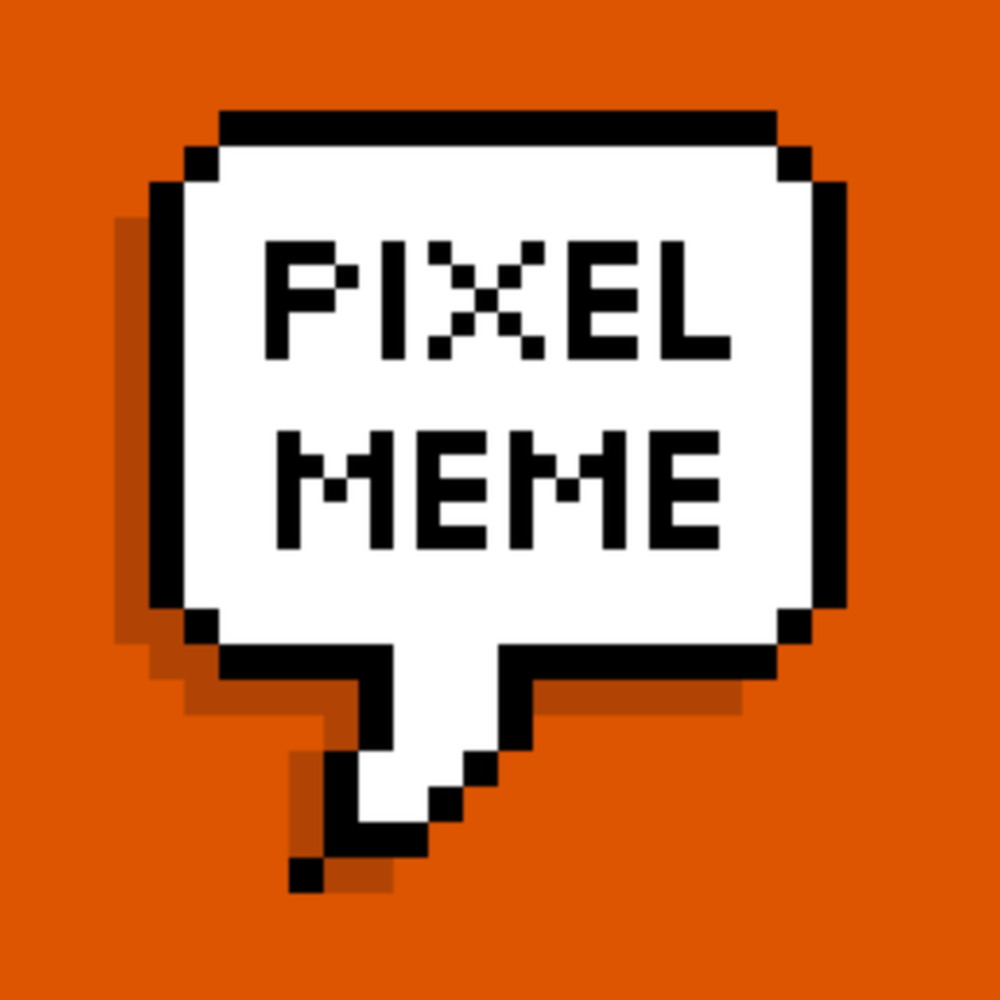

<p align="center">
  
</p>

<h1 align="center">PixelMe</h1>

<p align="center">
  <strong>Transform your photos into stunning pixel art — right on your iPhone.</strong>
</p>

<p align="center">
  <a href="https://m1zz.github.io/PixelMe/">Landing Page</a> &bull;
  <a href="https://m1zz.github.io/PixelMe/privacy.html">Privacy Policy</a> &bull;
  <a href="https://m1zz.github.io/PixelMe/terms.html">Terms of Service</a>
</p>

<p align="center">
  
  
  
  
</p>

---

## Features

| | Feature | Description |
|---|---|---|
| **9 Palettes** | GameBoy, NES, SNES, Vaporwave, Cyberpunk, Pastel, 8-Bit Retro, Film Noir, Original | Authentic color sets from iconic hardware |
| **AI Dithering** | Floyd-Steinberg, Atkinson, Ordered | Intelligently reduce colors while preserving detail |
| **Retro Filters** | CRT, Scanlines, Glitch, Vintage Game, VHS, Arcade | One-tap retro aesthetics |
| **Batch Processing** | Unlimited images | Same settings, export as ZIP |
| **Advanced Export** | PNG, JPEG, SVG, PDF | HD to 4K, transparent backgrounds |
| **Templates** | 15+ templates, 8 presets | Profile pics, avatars, sprites, social media |
| **GIF Animation** | Progressive pixelation, glitch, color cycling | Custom timeline editor |
| **Layer System** | 12 blend modes | Opacity, locking, merge/flatten |

---

## Tech Stack

- **Swift 5.0+** / **SwiftUI**
- **UIKit** + **Core Image** for image processing
- **ImageIO** for GIF creation
- **Combine** for reactive updates
- **StoreKit 2** for in-app purchases

---

## Getting Started

```bash
open PixelMe.xcodeproj
# Build & Run: Cmd + R
```

### Quick Usage

```swift
@EnvironmentObject var manager: DataManager

manager.selectedImage = myImage
manager.selectedColorPalette = .vaporwave
manager.ditheringType = .floydSteinberg
manager.filterEffect = .crt
manager.applyPixelEffect()
// Result: manager.pixelatedImage
```

---

## Project Structure

```
PixelMe/
├── Manager/
│   ├── DataManager.swift        # Main coordinator
│   ├── ColorPalette.swift       # 9 color palettes
│   ├── ColorReduction.swift     # AI dithering algorithms
│   ├── FilterEffects.swift      # 6 retro filters
│   ├── BatchProcessor.swift     # Batch processing
│   ├── ExportManager.swift      # Multi-format export
│   ├── TemplateManager.swift    # Templates & presets
│   ├── GIFCreator.swift         # GIF animation
│   ├── LayerManager.swift       # Layer system
│   ├── PurchaseManager.swift    # IAP management
│   └── SubscriptionManager.swift
├── Views/                       # SwiftUI views
├── Extension/                   # Swift extensions
├── Localizable.xcstrings        # EN/KO localization
└── docs/                        # GitHub Pages landing page
```

---

## Documentation

| Document | Description |
|---|---|
| [Landing Page](https://m1zz.github.io/PixelMe/) | Product landing page (EN/KO) |
| [FEATURES.md](FEATURES.md) | Detailed feature descriptions & API docs |
| [IMPLEMENTATION_GUIDE.md](IMPLEMENTATION_GUIDE.md) | UI implementation examples |
| [CHECKLIST.md](CHECKLIST.md) | App Store launch checklist |
| [IAP_INTEGRATION_GUIDE.md](IAP_INTEGRATION_GUIDE.md) | In-app purchase setup |
| [PRIVACY_POLICY.md](PRIVACY_POLICY.md) | Privacy policy |
| [TERMS_OF_SERVICE.md](TERMS_OF_SERVICE.md) | Terms of service |

---

## Contact

**Developer**: Hyunho Lee
**Email**: leeo@kakao.com

---

## License

All rights reserved. This source code is proprietary.
